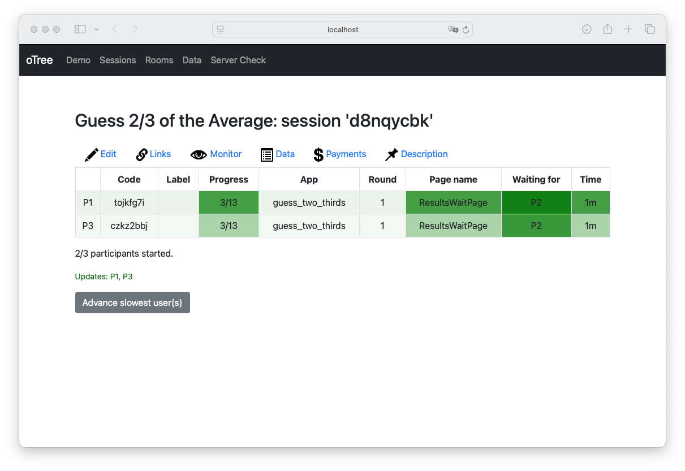

# Getting Started

If you want to use botex to create LLM participants for your own oTree experiments, you need the following:

- A working python environment >= 3.10 and preferably a virtual environment.
- [Google Chrome](https://www.google.com/chrome/) for scraping the oTree participant pages.

Then, activate the virtual environment and install the current development version of the package in it:

```bash
pip install git+https://github.com/joachim-gassen/botex.git
```

The easiest way to get botex up and running is to use its [command line interface](reference.md#command-line-interface). It guides you through the process to start botex on a running oTree instance. To set oTree up, you can run the following in the same virtual environment that your set up botex in:

```bash
pip install otree
otree startproject otree # Say yes for examples
cd otree 
otree devserver
```

Now, you have a locally running oTree sever. Switch to another terminal with the same virtual environment activated.
Then start the botex command line interface by running `botex`. You should see the following output:

```text
(.venv) user@host:~/github/project$ botex

Botex database file not provided. Defaulting to 'botex.db'
oTree server URL not provided. Defaulting to 'http://localhost:8000'
No LLM provided. Enter your model string here ("llamacpp" if you are using
llama.cpp) or press enter to accept the default [gemini/gemini-1.5-flash]: 
```

Assuming that you are fine with using the Google Gemini model, after pressing Enter you need to provide an API key. If you do not have one yet, you can get a free one from the [Google AI Studio](https://ai.google.dev). After entering the key, you can select an oTree experiment from the examples offered by the fresh oTree installation:

```text
Enter the API key for your LLM model (for the Gemini model,
you can get a free API key at https://aistudio.google.com/apikey): ***

Available session configurations:
1: guess_two_thirds
2: survey
Select a configuration by number: 
```

We suggest that you choose the Guess two Thirds game.

```text
Select a configuration by number: 1

Selected session configuration: guess_two_thirds
Enter number of human participants [0]: 
```

While this is up to you, we suggest that you play along, so select one human participant.

```text
Selected session configuration: guess_two_thirds
Enter number of human participants [0]: 1
Number of participants: 3
Number of human participants: 1
Session 'd8nqycbk' initialized
Human URLs: ['http://localhost:8000/InitializeParticipant/z0z34nrg']
You can monitor its progress at http://localhost:8000/SessionMonitor/d8nqycbk
Starting bots on session...
```

The botex bots will now start to scrape their oTree participant pages and play the game. You can monitor their progress by opening the session monitor URL in your browser. You should see something like this:



You see, the bots already made their first move and wait for you ('P2'). Time to act. Open the human URL in your browser and play the game. You will see the bots' moves in the session monitor as you progress. After you and the bots have completed the game, the botex app asks whether you want to export the data. We suggest that you do, providing a file name to save the LLM response data in the current working directory.

```text
Session complete.
You can view the oTree data at http://localhost:8000/SessionData/d8nqycbk
Download the oTree data at: http://localhost:8000/export
Enter CSV file name to export botex data to or press Enter to skip: two_thirds.csv
```

With this, the botex app terminates. You have run your first oTree experiment with LLM participants. Congratulations!

Take a look at the resulting CSV file. It contains the responses from the two bot instances and the reasoning for their answers. The data should look something like this:

| session_id | participant_id | round | question_id | answer | reason                                                                                                                                                                                |
|------------|----------------|-------|-------------|--------|---------------------------------------------------------------------------------------------------------------------------------------------------------------------------------------|
| d8nqycbk   | tojkfg7i       | 1     | id_guess    | 66     | "I will start by guessing 2/3 of 50, which is approximately 33. However, I expect others to do the same, so I'll choose a slightly higher number hoping to be closer to 2/3 of the average." |
| d8nqycbk   | tojkfg7i       | 2     | id_guess    | 30     | "I reasoned that many players will start with a guess of 0, assuming everyone is rational. But then many will increase their number, so I choose a number slightly above 0 to try and outsmart my competitors. The previous round's 2/3 average was 36. I'll try a much lower number this time." |
| d8nqycbk   | tojkfg7i       | 3     | id_guess    | 10     | "Given the previous rounds' results and the tendency for players to adjust their guesses, I expect most guesses to cluster around 0. Therefore, I'm choosing a low number to increase my chances of winning." |
| d8nqycbk   | czkz2bbj       | 1     | id_guess    | 66     | "I am choosing a number slightly below 67, since the other participants would probably consider this iterative reasoning and would bid even lower."                                    |
| d8nqycbk   | czkz2bbj       | 2     | id_guess    | 20     | "In the first round, the average was close to 60. If everyone assumes everyone else is rational, then the average will continue to decrease towards 0. However, since the number must be between 0 and 100, there is a lower bound to the guess. This time I will guess 20." |
| d8nqycbk   | czkz2bbj       | 3     | id_guess    | 10     | "Given the previous rounds, it's likely that participants will continue to reduce their guesses. I am choosing a very low number to try and win, acknowledging that if everyone does this, the average will be very low." |


You see that, in this run, our LLM bots were not particularly smart in the first round but then quickly adapted their strategies in the later rounds.

If you are interested in learning how to use Python API of botex in your own code, we suggest that you continue with the tutorial ['Run an oTree experiment with botex via Python'](tutorial.md). If you are interested in how different LLMs perform in the Guess Two Thirds game, you can continue with the tutorial ['Using botex to benchmark LLM performance in oTree experiments'](tutorial_compare_llms.md).
