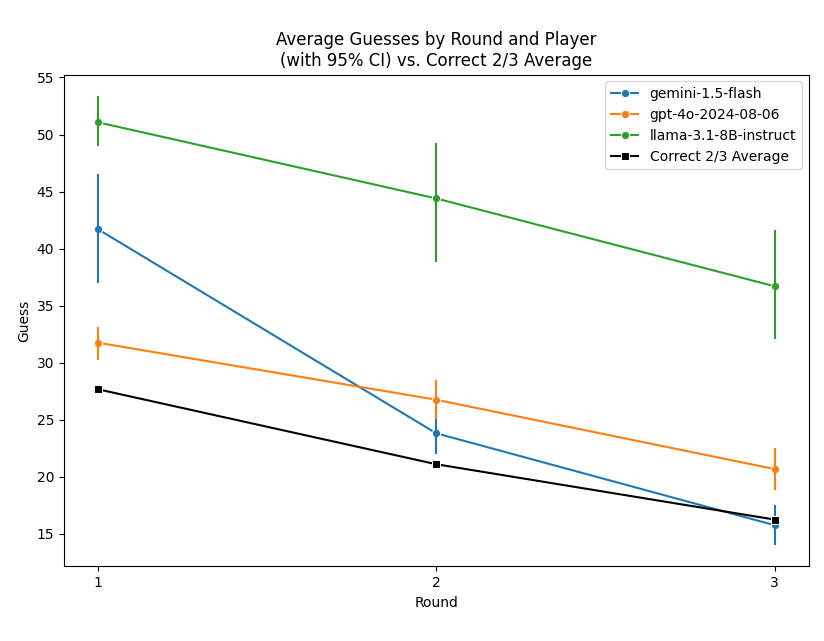
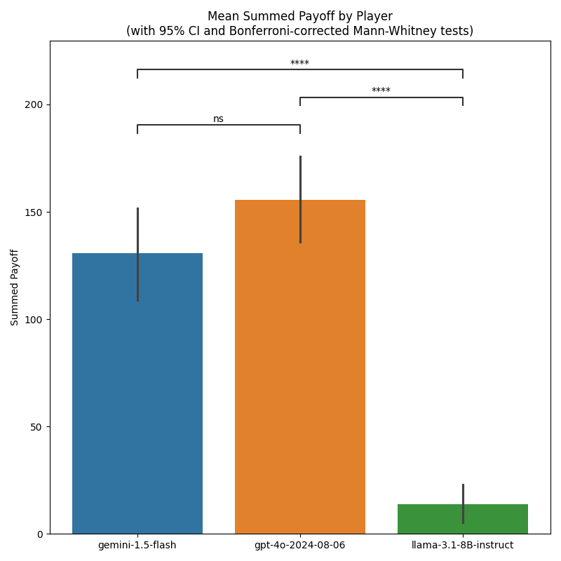

# Using botex to Benchmark LLM Performance in oTree Experiments

This tutorial walks you through a toy study that lets three different LLMs compete against each other in oTree's example Two Thirds game. It features the use of [LiteLLM](https://www.litellm.ai) as well as [llama.cpp](https://github.com/ggerganov/llama.cpp) for communicating with these models. It also uses the `run_single_bot()`function of the botex API and shows how you can evaluate the oTree data from the resulting experiment.

## Running the Experiment

Like the [Run an oTree experiment with botex](running_an_experiment.md) tutorial, the code below starts with starting an oTree server. In addition, it now also starts a llama.cpp server, meaning that you need to install llama.cpp and download the required LLM model file if you want to run the code 1:1 to reproduce the analysis presented below.

We compare the results of the following LLMs:

- [OpenAI's GPT-4p](https://openai.com)
- [Google's Gemini-1.5 Flash](https://aistudio.google.com)
- [LLama 3.1-8B Instruct](https://huggingface.co/meta-llama/Llama-3.1-8B-Instruct)

Different from the first tutorial, we will now use environment variables to configure the setup.

In your project folder, create a file called `botex.env` and add the following content:

```text
# Path your botex database file
BOTEX_DB="botex.sqlite"

# Your otree project path
OTREE_PROJECT_PATH="otree" 

# Path to your llama.cpp server executable
LLAMACPP_SERVER_PATH="llama.cpp/llama-server"

# Path to your llama.cpp model GGUF file
LLAMACPP_LOCAL_LLM_PATH="models/meta-llama-3.1-8B-instruct-Q8_0.gguf"

# Configure the use of GPU for llama.cpp
LLAMACPP_NUMBER_OF_LAYERS_TO_OFFLOAD_TO_GPU=32

# Your Google AI Studio API key
GEMINI_API_KEY="YOUR_API_KEY"

# Your OpenAI API key
OPENAI_API_KEY="YOUR_API_KEY"
```

Then, create a Python script called `run_exp_3llms.py` in the same folder and add the following code:

```python
import os
from datetime import date
import botex

import logging
logging.basicConfig(level=logging.WARNING)

import botex 

NPART = 3
NSESSIONS = 1

# Read the botex.env file to configure the botex setup
botex.load_botex_env()

# Start the oTree server
otree_server = botex.start_otree_server()
otree_server_url = os.environ['OTREE_SERVER_URL']

llamacpp = botex.start_llamacpp_server()

# Starts a single bot in a separate thread and returns the thread
def start_bot_thread(session, part_pos, model):
    thread = botex.run_single_bot(
        session_name = "guess_two_thirds",
        session_id = session["session_id"],
        participant_id = session['participant_code'][part_pos],
        url = session['bot_urls'][part_pos],
        model=model,
        throttle=True,
        wait = False
    )
    thread.start()
    return thread

for r in range(NSESSIONS):
    print(f"Running Session #{r+1}")
    session = botex.init_otree_session("guess_two_thirds", NPART)
    print(f"Session Monitor URL: {otree_server_url}/SessionMonitor/{session['session_id']}")
    threads = []
    threads.append(start_bot_thread(session, 0, "gemini/gemini-1.5-flash"))
    threads.append(start_bot_thread(session, 1, "gpt-4o-2024-08-06"))
    threads.append(start_bot_thread(session, 2, "llamacpp"))
    for t in threads:
        t.join()
    print(f"Session #{r + 1} complete.")


botex.stop_llamacpp_server(llamacpp)
botex.export_otree_data("exp_3llms_otree_wide.csv")
botex.stop_otree_server(otree_server)
```

The code above starts an oTree server, a llama.cpp server, and runs three bots in parallel. By default, `run_single_bot()` will wait for its bot's thread to finish before returning. But if you set `wait=False` it will instead return the thread after starting it. The subsequent joining of the threads ensures that the code will continue after all three bot threads have completed.

After `NSESSIONS` have been completed, the code exports the oTree data to a CSV file and stops both the oTree and the llama.cpp servers. 

If you want to reproduce the analysis presented below, you would need increase `NSESSIONS` so that multiple sessions are beeing played. The analysis below is based on 50 sessions.

## Analyze the Data

The code below reads the CSV file created by the script above, normalizes the data and plots the results. If you want to reproduce the analysis, you need to install the required Python packages first. You can do this by running the following command:

```bash
pip install pandas seaborn matplotlib statannotations
```

Then, create a Python script called `analyze_exp_3llms.py` in the same folder and add the following code:

```python
import seaborn as sns
import matplotlib.pyplot as plt
from statannotations.Annotator import Annotator  
import pandas as pd
import botex

def convert_normalized_otree_data_to_pandas(normalized_data):
    """
    Convert the dict of list-of-dicts (returned by botex.normalize_otree_data())
    into a dict of pandas DataFrames.
    
    Args:
        normalized_data (dict): 
            List of dicts, each representing a table of data from an oTree experiment.
            As returned by `botex.normalize_otree_data()`.
            Keys are table names (e.g. 'participant', 'session', 'myapp_group', etc.)
            Values are lists of dicts, each dict representing a row of data.

    Returns:
        A dict with the same keys, where each value is a pandas DataFrame.
    """
    dfs = {}
    for table_name, lod in normalized_data.items():
        df = pd.DataFrame(lod)
        dfs[table_name] = df
    
    return dfs

dta = botex.normalize_otree_data("exp_3llms_otree_wide.csv")
dfs = convert_normalized_otree_data_to_pandas(dta)

participants = [
    'gemini-1.5-flash', 'gpt-4o-2024-08-06', 'llama-3.1-8B-instruct'
]

df = dfs['guess_two_thirds_player'].merge(
    dfs['session'], on = 'participant_code', how = 'left'
).merge(
    dfs['guess_two_thirds_group'], 
    on = ['session_code', 'round'], 
    how = 'left'
)

df['round'] = df['round'].astype('category')
df['player_id'] = df['player_id'].astype('category')
df['player_id'] = df['player_id'].cat.rename_categories({
    1: participants[0],
    2: participants[1],
    3: participants[2]
})

plt.figure(figsize=(8, 5))

sns.lineplot(
    data=df, x='round', y='guess', hue='player_id',
    marker='o', errorbar='ci', n_boot=1000, err_style='bars',  
    legend='full'
)

correct_avg_summary = df.groupby(
    'round', as_index=False
)['two_thirds_avg'].mean()

sns.lineplot(
    data=correct_avg_summary,
    x='round', y='two_thirds_avg', color='black', 
    marker='s', label='Correct 2/3 Average'
)

plt.title(
    'Average Guesses by Round and Player\n(with 95% CI) vs. Correct 2/3 Average'
)
plt.xlabel('Round')
plt.ylabel('Guess')
plt.xticks([1, 2, 3])
plt.legend()
plt.tight_layout()
plt.show()

df_sums = (
    df.groupby(['session_code', 'player_id'], as_index=False)
      .agg({'payoff': 'sum'})
)

plt.figure(figsize=(8, 8))

ax = sns.barplot(data=df_sums, x='player_id', y='payoff', hue='player_id')
pairs = [
    (participants[0], participants[1]),
    (participants[0], participants[2]),
    (participants[1], participants[2])
]
annotator = Annotator(
    ax, pairs, data=df_sums, x="player_id", y="payoff"
)
annotator.configure(
    test="Mann-Whitney", text_format="star",
    comparisons_correction="bonferroni"
)
annotator.apply_and_annotate()

plt.title(
    'Mean Summed Payoff by Player\n'
    '(with 95% CI and Bonferroni-corrected Mann-Whitney tests)'
)
plt.xlabel("") 
plt.ylabel('Summed Payoff')
plt.tight_layout()
plt.show()
```

The first plot shows the average guesses by round and player, with 95% confidence intervals, and the correct 2/3 average.



As you can see, OpenAI's 4o model seems to make the best guesses in the first round, indicating that it might have a little bit of an edge in higher order beliefs. However, Google Gemini quickly picks up in later rounds and tend to be closer towards the correct 2/2 average towards the end. In comparison, Llama 3.1-8B Instruct guesses to high throughout.



The second plot shows the mean summed payoff by player, with 95% confidence intervals and Bonferroni-corrected Mann-Whitney tests for cross-participant differences. It seems that OpenAI's 4o model and Google Gemini are roughly at par (the difference between the two is no significant at conventional levels while both clearly dominate Llama 3.1-8B Instruct.

